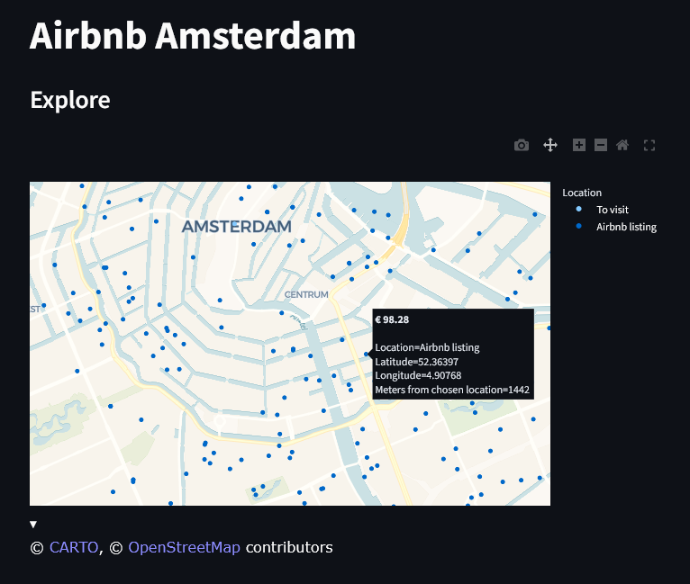
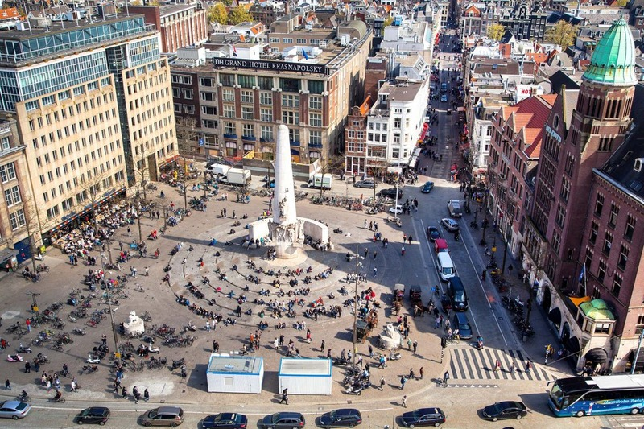

# Airbnb Amsterdam Explorer

A streamlit web app for exploring Airbnb listings in Amsterdam, Netherlands. This dashboard allows to visualize and filter over 900 Airbnb listings with detailed information about pricing, location, and distance from key landmarks.



## Features

- **Interactive Map**: Visualize Airbnb listings across Amsterdam with Dam Square as the reference point
- **Price Filtering**: Focus on budget-friendly options (under €100 per night)
- **Advanced Filtering**: Filter listings by various attributes including price, location, and distance
- **Data Table**: View and sort detailed information about each listing
- **Data Analysis**: Leverage NumPy for efficient numerical computations and data processing

## Live Demo

Try the live application at: [amsterdam.streamlit.app](https://amsterdam.streamlit.app)

## Installation

1. Clone this repository:
   ```
   git clone https://github.com/remoale/amsterdam
   cd amsterdam
   ```

2. Create and activate a virtual environment:
   ```
   python -m venv .venv
   source .venv/bin/activate  # On Windows: .venv\Scripts\activate
   ```

3. Install dependencies:
   ```
   pip install -r requirements.txt
   ```

4. Start the Streamlit application:
   ```
   streamlit run app.py
   ```

5. Navigate to the URL displayed in the terminal (typically http://localhost:8501)

## Usage

Use the interactive map to explore listings:
   - Hover over markers to see price information
   - Use the filter options to narrow down your search
   - Toggle between different views using the sidebar controls

## Data Sources

The application uses two main data sources:
- `WK1_Airbnb_Amsterdam_listings_proj_solution.csv`: Contains basic listing information with coordinates
  - Includes Airbnb Listing ID, Price, Latitude, Longitude, Distance from Dam Square, and Location type
  - Over 6,000 listings, with 900+ under €100 per night
  - Coordinates centered around Dam Square (52.3731° N, 4.8939° E)
  
- `WK2_Airbnb_Amsterdam_listings_proj_solution.csv`: Contains detailed listing attributes
  - Includes over 2000 hosting sources with house-specific attributes
  - Provides comprehensive filtering options for detailed analysis

## Technologies Used

- **Streamlit**: Web application framework for creating interactive data apps
- **Plotly Express**: Interactive map visualization with customizable markers and hover information
- **Pandas**: Data manipulation and analysis for handling the Airbnb listings
- **NumPy**: Numerical computing library for efficient data processing and calculations

## Inside Airbnb Amsterdam Data

The dataset provides insights into the Amsterdam Airbnb market:

- **Geographic Coverage**: Listings across all neighborhoods in Amsterdam
- **Price Range**: Focused on budget-friendly options (under €100 per night)
- **Distance Metrics**: All distances calculated from Dam Square, the historic center
- **Listing Types**: Includes both "To visit" locations and "Airbnb listing" properties
- **Data Processing**: Utilizes NumPy for efficient numerical operations on coordinates and distances

## About Dam Square

Dam Square is a historic heart of Amsterdam and serves as the central reference point for this application. Located at coordinates 52.3731° N, 4.8939° E.



## Acknowledgements

- Data sourced and cleansed from [Inside Airbnb](https://insideairbnb.com/get-the-data/) Amsterdam listings
- Built with [Streamlit](https://streamlit.io)
